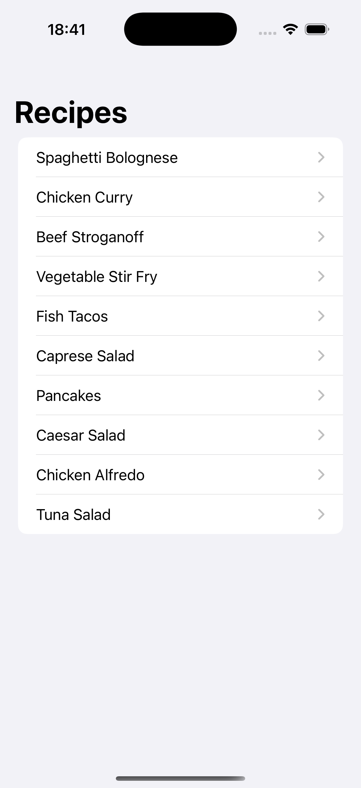
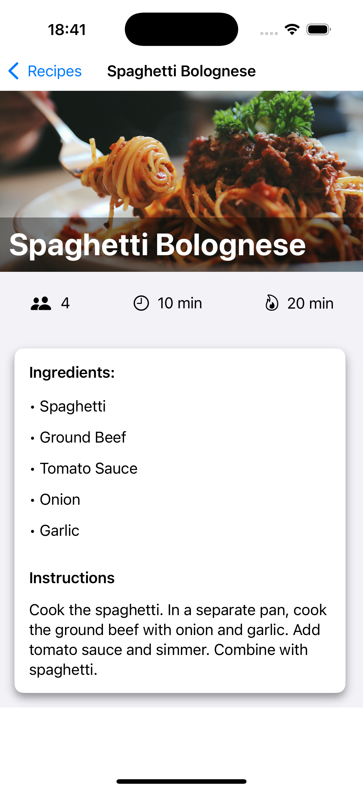

# Simple Recipe App

Welcome to my — **Simple Recipe App**!  
This iOS application was built as a learning experience to explore the foundations of mobile development using SwiftUI.

Through this project, I learned how to:
- Build dynamic user interfaces using SwiftUI
- Navigate between views using `NavigationView` and `NavigationLink`
- Work with layout components like `VStack`, `HStack`, `ZStack`, and `ScrollView`
- Create custom data models and sample datasets
- Run and test apps in the Xcode iOS Simulator

---

## Project Description

Simple Recipe App is a mobile application that displays a list of recipes.  
When a recipe is selected, the app shows detailed information, including:

- Ingredients  
- Instructions  
- Number of servings  
- Preparation time  
- Cook time  

All within a clean, user-friendly layout.

This project helped me understand the core structure of SwiftUI apps and how views work together with data.

---

## Features

- **List Recipes**: Browse a scrollable list of recipes  
- **Recipe Details**: View ingredients, instructions, servings, and time info  
- **Navigation**: Seamless navigation between the recipe list and detail screens  
- **Images**: Each recipe includes an image for visual appeal

---

## Built With

- **SwiftUI** – For building modern and reactive user interfaces  
- **Xcode** – Apple's IDE for iOS development  
- **iOS Simulator** – To test the app without a physical device

---

## How to Run

1. Open the project in **Xcode**.  
2. Choose a device in the **Simulator** (e.g., iPhone 16).  
3. Press the **Run** button ▶️.  
4. Explore the recipe list and tap to view full details!

---

## Screenshots 

  
  

---

